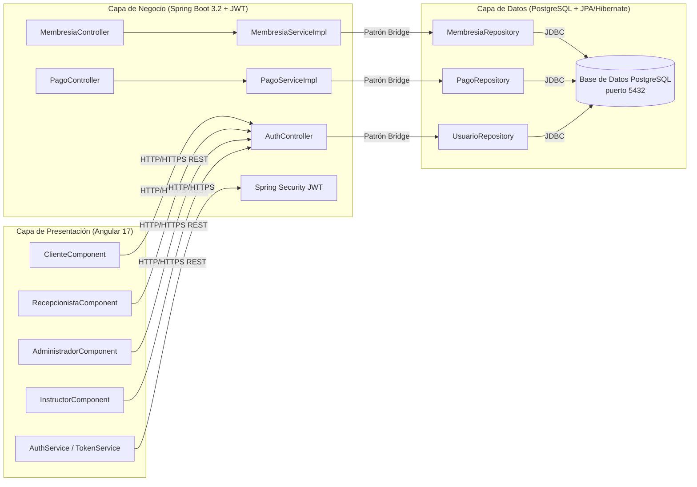

# Contribución Estudiantil

## Información del Desarrollador

- Nombre: Camarillo Olaez Juana Jaqueline / Guerrero Sánchez Princes Rocio / Ríos Ríos Carol Guadalupe
- Universidad: Universidad Tecnológica del Norte de Guanajuato
- Fecha: 2026/06/01

## Mejoras Propuestas

1. Agregar notificaciones automáticas por correo cuando una membresía esté próxima a vencer.
2. Implementar un módulo de reportes exportables en PDF para el administrador.
3. Integrar una aplicación móvil complementaria para que los clientes consulten su membresía.

## Observaciones

Este proyecto aplica una arquitectura de tres capas (Presentación, Negocio y Datos) usando Angular, Spring Boot y PostgreSQL, con el patrón Bridge como eje central de desacoplamiento entre la lógica de negocio y la persistencia de datos.

---

## Fortalezas del Proyecto

1. **Separación de responsabilidades clara**: La arquitectura de tres capas garantiza que cada componente tenga una función específica, facilitando el mantenimiento y la evolución independiente de cada capa sin afectar a las demás.
2. **Patrón Bridge implementado**: El desacoplamiento entre la abstracción (interfaces Repository) y la implementación concreta (JPA/Hibernate + PostgreSQL) permite cambiar el proveedor de persistencia sin modificar la lógica de negocio.
3. **Seguridad robusta en capas**: Autenticación JWT stateless, autorización por roles (Cliente, Instructor, Recepcionista, Administrador) y validación de entradas en frontend y backend garantizan un esquema de defensa en profundidad.
4. **Escalabilidad segmentada**: Cada capa puede escalarse de forma independiente. Si el backend experimenta alta carga, se pueden desplegar instancias adicionales del servidor Spring Boot sin afectar el frontend ni la base de datos.
5. **Metodología ágil con SCRUM**: El desarrollo iterativo en Sprints permite entregar incrementos funcionales verificables, validar avances constantemente y adaptarse a cambios de requerimientos sin comprometer la estabilidad del sistema.

---

## Oportunidades de Mejora

1. **Implementar caché con Redis**: Las consultas frecuentes de estado de membresías podrían almacenarse en caché para reducir la carga sobre PostgreSQL y mejorar los tiempos de respuesta.
2. **Migrar a arquitectura de microservicios en el futuro**: Separar los módulos de membresías, pagos y rutinas en servicios independientes permitiría escalar solo los componentes con mayor demanda.
3. **Agregar notificaciones en tiempo real**: Implementar WebSockets o Server-Sent Events para alertar a recepcionistas cuando una membresía venza durante el día sin necesidad de recargar la página.
4. **Aumentar la cobertura de pruebas**: Elevar la cobertura de pruebas unitarias e integración al 90% en la capa de negocio para reducir el riesgo de defectos en producción.
5. **Integrar pasarela de pago real**: Conectar el módulo de pagos con una pasarela como Stripe o Conekta para procesar cobros en línea directamente desde el portal del cliente.

---

## Tecnologías Utilizadas

| Capa | Tecnología | Versión | Propósito |
|------|-----------|---------|-----------|
| Frontend | Angular + TypeScript | 17.x | Interfaz reactiva con componentes por rol |
| Frontend | RxJS Observables | 7.x | Gestión de flujos de datos asíncronos |
| Backend | Spring Boot | 3.2.x | API REST y lógica de negocio |
| Backend | Java | 17+ LTS | Lenguaje de programación del servidor |
| Seguridad | Spring Security + JWT | 6.x | Autenticación y autorización por roles |
| Base de Datos | PostgreSQL | 12+ | Almacenamiento relacional con transacciones ACID |
| ORM | JPA / Hibernate | Última | Mapeo objeto-relacional (patrón Bridge) |
| Conexión | JDBC | — | Conexión a base de datos (puerto 5432) |
| Construcción | Maven | 3.6+ | Gestión de dependencias |
| Pruebas | JUnit 5 + Postman | Última | Pruebas unitarias y de API |

---

## Diagrama de Arquitectura



---

## Requerimientos Funcionales

- RF-01 El sistema deberá permitir el registro de clientes con nombre, correo electrónico, teléfono y tipo de membresía.
- RF-02 El sistema deberá permitir la autenticación de usuarios mediante correo y contraseña, generando un token JWT.
- RF-03 El sistema deberá permitir a la recepcionista verificar el estado de membresía de un cliente al momento de su entrada.
- RF-04 El sistema deberá permitir al administrador crear, actualizar y cancelar membresías.
- RF-05 El sistema deberá permitir a los clientes consultar su historial de pagos de los últimos 12 meses.
- RF-06 El sistema deberá enviar una alerta cuando una membresía tenga 7 días o menos antes de su fecha de vencimiento.
- RF-07 El sistema deberá permitir a los instructores crear y asignar rutinas de entrenamiento personalizadas a los clientes.
- RF-08 El sistema deberá permitir al administrador generar reportes de ingresos mensuales agrupados por tipo de membresía.
- RF-09 El sistema deberá restringir el acceso a cada módulo según el rol del usuario autenticado (Cliente, Instructor, Recepcionista, Administrador).
- RF-10 El sistema deberá registrar cada transacción de pago con fecha, monto, tipo de membresía y usuario responsable.

# 📸 Evidencias

***Las evidencias se debaran incluir en tu repositorio propio, una vez terminado cargar el URL resultante en Classroom.***

## Evidencia 1

Captura del Fork creado.

---

## Evidencia 2

Resultado de:

```bash
git remote -v
```


---

## Evidencia 3

Resultado de:

```bash
git branch
```

---

## Evidencia 4

Resultado de:

```bash
git log --oneline
```

---

## Evidencia 5

Captura del Pull Request.


---

## Evidencia 6

URL del Pull Request.
https://github.com/JaquelineCamarillo/simple-webapp-flask.git

## Team Members